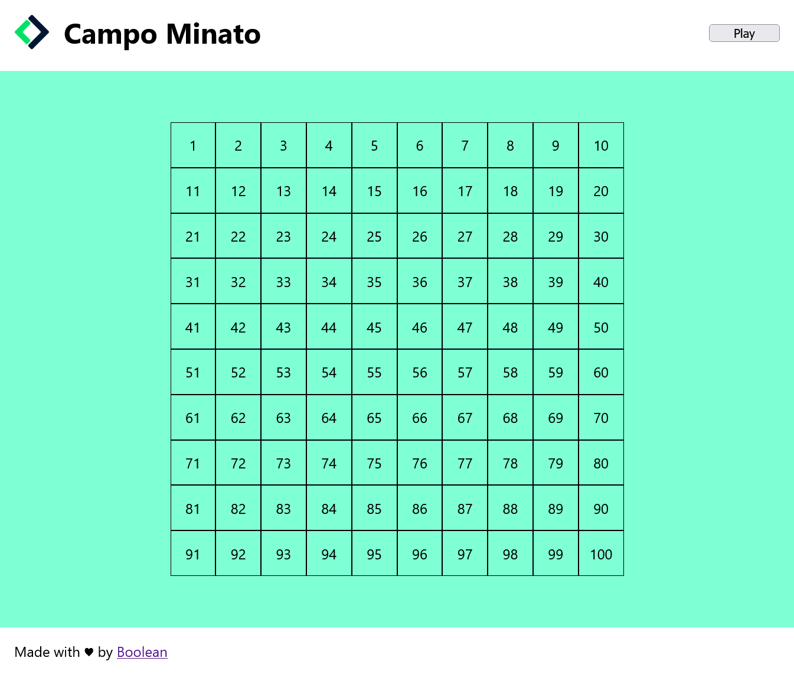

# Griglia campo Minato
### Riproduzione del gioco campominato

#### ***Tools***
- __HTML__ = struttura;
- __CSS__ = estetica;
- __JAVASCRIPT__ = istruzioni.

#### ***Step***
1. Griglia gioco;
2. Logica gioco.

#### ***Consegna Fase 1***

- Struttura gioco inizializzata HTML e Css (_Header_ e _Footer_);
- Griglia: struttura celle innestata con _Javascript_: rappresentazione 100 caselle, con un numero compreso tra 1 e 100, divise in 10 caselle per 10 righe;
- Se gamerCm clicca su bottonePlay allora campoMinato add classe active;
- Se gamerCm clicca su cellaCampo, allora cellaCampo _cambia colore_ (azzurro) __+__ _stampo_ in console numero cellaCampo su cui ho cliccato.

✨ 15_11_2023

_toBeContinued.._